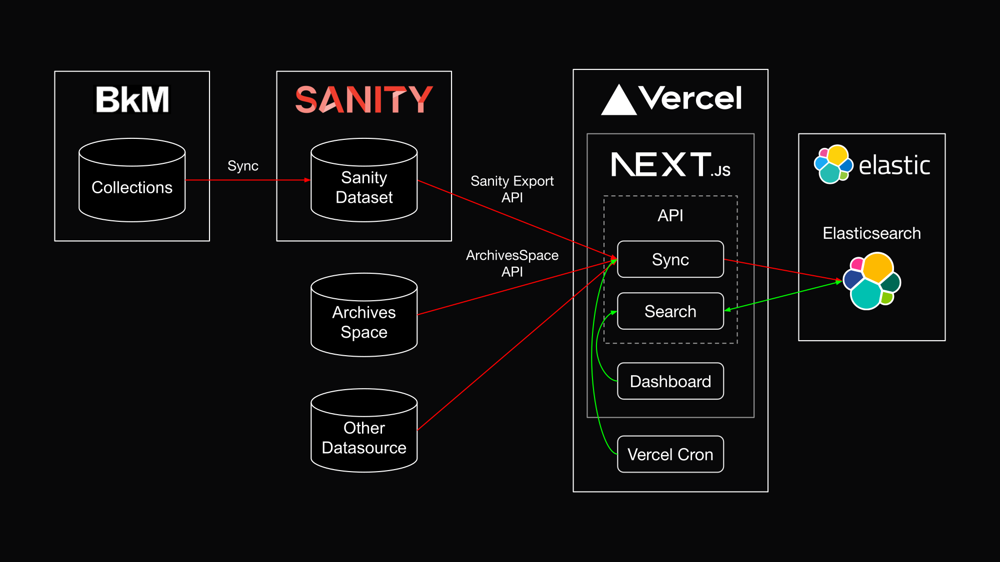

# bkm-elasticsearch-search-api

## Architecture



## Installation

### Install dependencies

```
npm install
```

### Install Elasticsearch

#### Cloud Elasticsearch

1. [Sign up for an Elasticsearch Cloud account](https://cloud.elastic.co/).
2. Create a deployment. The free tier is sufficient for development.

#### Local Development Insecure Elasticsearch

Run Elasticsearch in a Docker container:

The `/docker` folder contains a `docker-compose` file for running the Elasticsearch stack locally. (No secruity, only suitable for local development.)

1. `cd docker`
2. `docker compose up`.

Once running, elasticsearch & kibana should be up and running at:

1. Elasticsearch: http://0.0.0.0:9200/
2. Kibana: http://0.0.0.0:5601/app/home#/

### Environment variables

You'll need a `.env` file and a `.env.test` (for testing) with the following variables:

```
SANITY_PROJECT_ID=yourProjectId
SANITY_DATASET=yourDataset
SANITY_TYPES=collectionObject,collectionArtist,exhibition,page,product # only index documents of these types
ELASTIC_USE_CLOUD=false
ELASTIC_LOCAL_NODE=http://localhost:9200
ELASTIC_CLOUD_ID=yourCloudId # only needed if ELASTIC_USE_CLOUD=true
ELASTIC_CLOUD_USERNAME=yourCloudUsername
ELASTIC_CLOUD_PASSWORD=yourCloudPassword
ELASTIC_INDEX_NAME=content # name of the index to create
CHUNK_SIZE=1000 # number of documents to index in one batch
HYDRATION_DEPTH=4 # 0 = no hydration, 1 = hydration of first level references, 2 = hydration of second level references, etc.
WEBSITE_URL=https://brooklynmuseum.org # used for generating URLs for search results
```

## Testing

This project uses Jest for testing. Tests are located in the `__test__` folder and are split up into unit tests and integration tests.

### Run the tests

- To run & watch unit tests: `npm test:watch`
- To run & watch all tests: `npm test:watchall`
- Run only unit tests: `npm test:unit`
- Run only integration tests: `npm test:integration`

## Upsert Sync

Before running a sync, ensure that you are using the correct Elasticsearch server in your `.env` file.

### Run the sync

Sync test data from local test file: `npm run sync:test`
(WARNING: this will delete all data in the index. Can only be used with a non-cloud Elasticsearch instance.)

Sync the live Sanity dataset: `npm run sync`
(Creates a new index if one doesn't exist. Otherwise, updates the existing index.)

## Run

### Local Development

```
npm run dev
```

## API

### Search

Search for "spike" filtered by "exhibition" type:

```
http://localhost:3000/api/search?query=spike&type=exhibition
```

### Search-as-you-type

Search-as-you-type for "spike":

```
http://localhost:3000/api/searchAsYouType?query=spike
```

## TODO

- Museum Location: only getting museumLocationId. Maybe museum location needs to be a document.
- Artist: is it a "collectionArtist" or an "Artist" augmented with collectionArtist data?
- Documents, esp. Page, might need a "Summary", "Description", or "CTA" field for short text. Can be used in search results. (will still index all page content)
- "language" or "locale"? (e.g. "en-US")
- Derek: converting block text to plain text not working too well?
- Doesn't collection object have an "image" property? (sometimes it's not rank 0)
